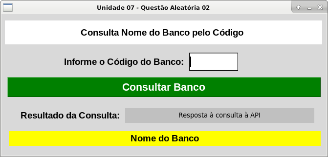

# Interface com TkInter! Criando uma mini consulta usando uma API
Repositório referente a uma atividade do curso de TSI, na matéria de POO em Python.

<b>Atividade:</b>
Implemente utilizando Python uma aplicação de <i>‘Consulta o nome do BANCO a partir do código informado’</i> com as funcionalidades detalhadas a seguir, utilizando a interface <b>TKInter</b> disponibilizada como modelo (link do modelo a seguir):

<b>Orientações:</b>

<li>Usuário deve inserir o CÓDIGO DO BANCO no campo ‘Entry1’ e clicar no botão ‘Consultar Banco’
<li>Aplicação deve consultar o Banco na API indicada e:
<ul>Caso não obtenha dados para o Banco informado:
<ul><li>‘Resultado da Consulta: Banco Inválido’
<ul><li>Caso obtenha os dados para o Banco informado:</li>
‘Resultado da Consulta: Banco Cadastrado na Base’
<li>Exibir o campo Nome do Banco com o respectivo nome.
(trocar o texto ‘Nome do Banco’ pelo nome do banco)
